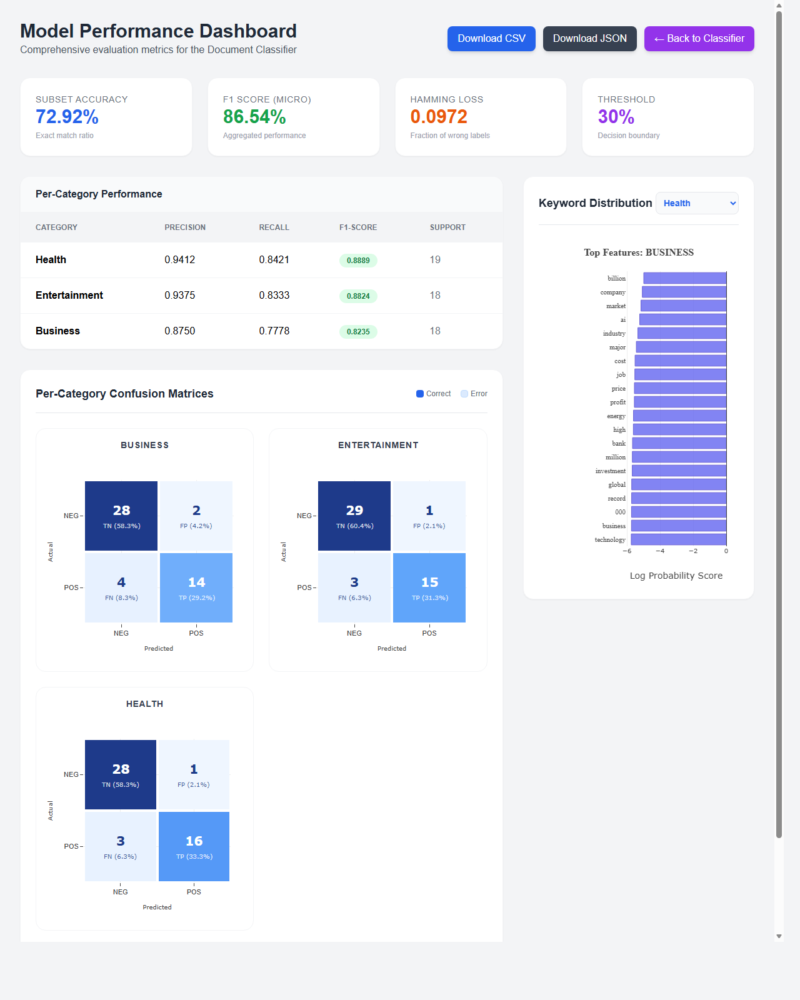
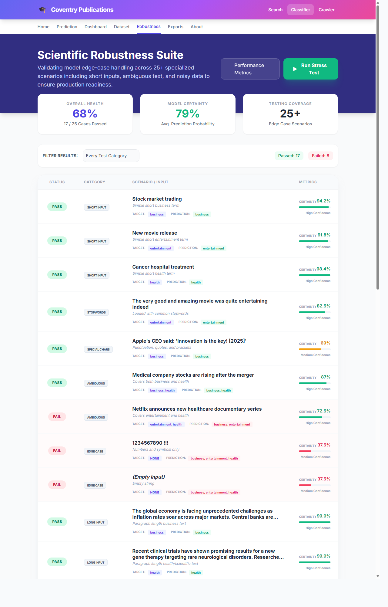

# Coventry University: Vertical Search Engine & Multi-Label Classifier
### Research Centre for Computational Science and Mathematical Modelling (ICS)


## Overview
This project builds a search engine and a document classifier for academic publications from the Coventry University PurePortal. It covers three main components: a web crawler for data collection, a TF-IDF search engine for retrieval, and a multi-label classifier to categorise documents.

---

## Task 1: Search Engine

### Web Crawler (BFS)
The crawler uses Breadth-First Search to navigate the PurePortal and collect publication metadata from author profile pages.
- **Follows `robots.txt`** and waits 2 seconds between requests to avoid overloading the server.
- **Incremental**: Uses URL hashing to ensure only new publications are downloaded on each run, reducing redundant server load.
- **Handles pagination** to collect complete author bibliographies across multiple pages.

### Search and Ranking
The engine uses **TF-IDF** with **Cosine Similarity** to rank documents against a query. Different parts of each publication are given different weights so more important fields have more influence on the result:

| Field | Weight | Why |
| :--- | :--- | :--- |
| **Title** | 3.0 | Most directly describes what the paper is about. |
| **Authors** | 2.5 | Important for author-specific searches. |
| **Keywords** | 2.0 | Summarise the topic of the paper. |
| **Year** | 1.5 | Helps surface more recent work. |
| **Abstract** | 1.0 | Provides broader context. |

Each search result also shows a **contribution breakdown** — a percentage split of how much each field contributed to the final score, so the ranking is transparent and explainable.

- **Retrieval complexity**: O(Q * L) for query length Q and posting list depth L.
- **Crawling complexity**: O(V+E) for BFS graph traversal over V pages and E links.

---

## Task 2: Multi-Label Classifier

The classifier assigns one or more categories (Business, Health, Entertainment) to a document at the same time, rather than picking just one.

### How It Works
- **Algorithm**: Multinomial Naive Bayes with Classifier Chains. Each label is predicted in sequence, and earlier predictions are passed as input features to later ones — this allows the model to account for label relationships.
- **Feature extraction**: TF-IDF with up to 5,000 features.
- **Smoothing**: Laplace smoothing ($\alpha = 0.1$) to handle words not seen during training.
- **Threshold**: A confidence threshold of **0.30** is used to decide whether a label is assigned. This was chosen to get the best balance between precision and recall ($F_1 \approx 86.5\%$).

### Core Preprocessing Architecture
Both the search engine and the classifier utilize the same text preprocessing pipeline—including tokenization, stop-word removal, and lemmatization. This ensures that words processed during a live search are treated identically to those processed during model training.

---

## Automation
- A background scheduler runs the crawler automatically every **Monday at 11:00 AM** to keep the index up to date.

---

## System Demonstration & Test Cases
The system's performance can be verified using the following specific scenarios from the demonstration script.

### Search Scenarios
1. **Scenario #1: Keyword-in-Context Ranking**
   - Query: `Gas Turbine` (Matches exact phrase in titles/abstracts)
   - [View Search Result](./screenshots/1_search_gas_turbine.png)
2. **Scenario #2: Academic Keyword Search**
   - Query: `Machine Learning` (Returns relevant AI/ML publications)
   - [View Search Result](./screenshots/2_search_machine_learning.png)
3. **Scenario #3: Author-Based Boosting**
   - Query: `Gaura` (Prioritizes specific authors with 2.5x weight)
   - [View Search Result](./screenshots/3_search_author_boost.png)

### Classification Scenarios
4. **Business**: Financial reports, mergers, and market trends.
   - [View classification](./screenshots/4_classify_business.png)
5. **Health**: Medical research, diseases, and healthcare news.
   - [View classification](./screenshots/5_classify_health.png)
6. **Entertainment**: Movies, music, and celebrity news.
   - [View classification](./screenshots/6_classify_entertainment.png)
7. **Multi-Label**: Articles spanning multiple categories (e.g., Pharma Mergers).
   - [View classification](./screenshots/7_classify_multilabel.png)

### Performance Evaluation
The system achieves a **micro-averaged F1-Score of 86.5%** across all categories.

| Model Performance Dashboard | Robustness Test Results |
| :---: | :---: |
| [](./screenshots/8_metrics_dashboard.png) | [](./screenshots/9_robustness_testing.png) |


---

## How to Run

### 1. Install dependencies
```bash
pip install -r requirements.txt
python -c "import nltk; nltk.download(['punkt', 'stopwords', 'wordnet'])"
```

### 2. Start the server
```bash
# db.sqlite3 is included so the search index loads immediately
python manage.py runserver
```
Visit: `http://127.0.0.1:8000/`

---

## Ethical Compliance
The crawler identifies itself as an educational user-agent, follows `robots.txt` rules, and does not bypass any access controls. It is built strictly for academic assessment purposes.

---
**Module**: Information Retrieval & Machine Learning Portfolio
